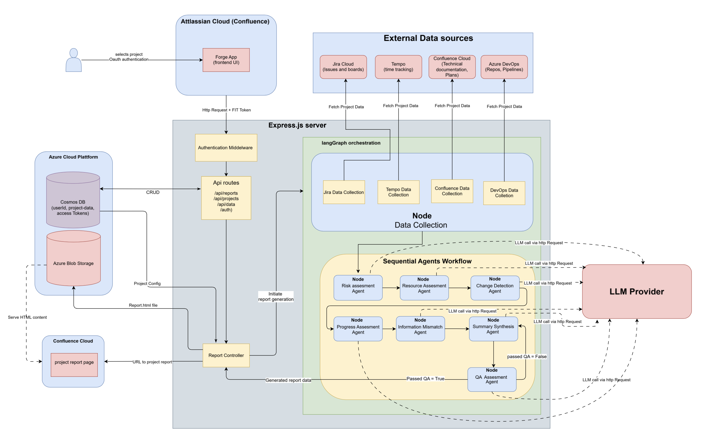

# RECAP — Report Engine for Cross-platform Analysis of Projects

**Agentic project status reporting across Jira, Confluence, Azure DevOps and Tempo.**

RECAP is an LLM-powered project analytics and reporting system developed as a Bachelor of Science thesis project in Software Engineering and Management at the Department of Computer Science and Engineering, University of Gothenburg and Chalmers University of Technology.

The system collects fragmented project data from multiple development and project-management platforms, analyzes it using specialized LLM agents, and generates a traceable project status report directly inside **Confluence**.

Rather than introducing another standalone application for project managers to learn and maintain, RECAP was built as an **Atlassian Forge app integrated into Confluence** — software already used in the target organization.

---

## The Problem

Software projects often distribute important information across several tools:

* Jira contains tasks, estimates and project status
* Confluence contains requirements and documentation
* Azure DevOps contains repositories, commits and technical activity
* Tempo contains time-tracking data

This makes it difficult for project managers and stakeholders to get a reliable overview of a project's actual status without manually searching through several systems or asking individual team members for updates.

RECAP was designed to bring that information together and turn it into one actionable project-status report.

---

## My Contribution

RECAP was developed collaboratively by a six-person Bachelor thesis team. My main focus was **system integration, authentication and the AI/reporting pipeline**.

My contributions included:

* Implementing the **OAuth authentication flows** for the external services used by RECAP, including Jira, Confluence, Azure DevOps and Tempo.
* Connecting the authentication and integration flows **end-to-end from the Forge UI to the Express backend**, combining the OAuth implementation with the data-collection functionality developed by other team members.
* Integrating an **LLM hosted through Azure AI Foundry** into RECAP so it could be used by the agentic analysis workflow.
* Refining the specialized LLM agents by iterating on their prompts, responsibilities and expected output.
* Working with the data collected from the different project-management tools to ensure that the agents received useful, appropriately structured input.
* Refining the agent outputs and report-generation flow so that the analyzed data could be presented correctly and clearly in the final **HTML project-status report**.
* Iterating on the final report presentation to make the generated insights readable, structured and useful for project managers and other stakeholders.

This work gave me experience working across the full integration flow — from user authentication and external APIs, through backend processing and LLM orchestration, to the final user-facing output.


---

## How RECAP Works

```text
Jira ───────────────┐
Confluence ─────────┤
Azure DevOps ───────┼──► Data Collection
Tempo ──────────────┘
                           │
                           ▼
                     Data Processing
                           │
                           ▼
                  Specialized LLM Agents
                           │
                           ▼
                    Summary Agent
                           │
                           ▼
                 Quality Assurance Agent
                           │
                           ▼
                  Traceable HTML Report
                           │
                           ▼
                       Confluence
```

The overall pipeline follows four main stages:

**Data Retrieval → Multi-Agent Evaluation → Automated Quality Control → Publication**

---

## Architecture

RECAP uses a client-server architecture.

The **Atlassian Forge application** provides the interface inside Confluence, while the backend handles authentication, API integrations, data processing and the agentic analysis workflow.



*System architecture of RECAP, from our Bachelor thesis.*

---

## Agentic Workflow

RECAP uses **LangGraph** to orchestrate several specialized LLM-based agents.

Each agent focuses on a different aspect of project health.

### Risk Assessment Agent

Identifies risks related to:

* schedule
* resources
* technical issues
* scope and project changes

### Resource Assessment Agent

Analyzes resource usage and potential bottlenecks, including:

* workload distribution
* logged time versus technical activity
* potential single points of failure
* resource imbalance

### Progress Assessment Agent

Cross-references administrative project status with actual technical activity.

For example, a Jira issue marked as progressing can be compared with development activity in Azure DevOps.

### Information Mismatch Agent

Acts as a cross-platform fact checker.

It identifies inconsistencies such as:

* work marked as complete in one system but not another
* missing estimates
* incomplete documentation
* discrepancies between Jira, Confluence and DevOps

### Change Detection Agent

Looks for deviations between the intended project plan and actual execution, including:

* scope creep
* changing priorities
* repeated task reopening
* unexpected technical work

### Summary Agent

Combines the specialized analyses into a high-level project overview intended for project managers and other stakeholders.

### Quality Assurance Agent

Performs an additional verification step by comparing generated conclusions against the underlying project data.

The goal is to reduce unsupported AI-generated claims and improve the traceability of the final report.

---

## Traceability

Trust in AI-generated reports was an important concern identified during the research.

RECAP was therefore designed so that findings could be traced back to the project artifacts that supported them, such as:

* Jira issue IDs
* commits
* project documentation
* development activity

The purpose was not for the AI to replace human judgment, but to make it easier for a project manager to identify relevant information and then verify it at the source.

---

## Technology

### Backend & Cloud

* Node.js
* Express
* Microsoft Azure
* Azure Cosmos DB
* Azure Blob Storage
* Azure AI Foundry

### AI & Orchestration

* Large Language Models
* LangGraph
* Specialized agent workflow
* Automated QA / fact-checking stage

### Integrations

* Jira REST API
* Confluence REST API
* Azure DevOps API
* Tempo API
* OAuth 2.0

### User Interface

* Atlassian Forge
* Confluence integration
* React / Forge UI

---

## Why Confluence?

A deliberate design decision was to avoid creating another standalone project-management application.

Project managers already worked with tools such as Jira and Confluence. Adding another application would introduce another interface to learn, another system to maintain, and another place users would need to remember to visit.

RECAP was therefore implemented as a **Forge application inside the existing Atlassian environment**.

The user can configure projects and generate reports from within the ecosystem they already use, while the generated project-status report is published directly to Confluence.

---

## Evaluation

RECAP was evaluated in an industry setting using project managers and other stakeholders.

In the final comparative evaluation, participants rated several aspects of the system on a five-point scale:

| Evaluation                                |   Mean score |
| ----------------------------------------- | -----------: |
| More efficient project-status assessment  | **4.25 / 5** |
| Could reduce manual information gathering | **4.25 / 5** |
| Quick navigation to relevant information  | **4.00 / 5** |
| Report contained the information needed   | **3.50 / 5** |
| Support for decision-making               | **3.50 / 5** |
| Trust in report information               | **2.50 / 5** |

One of the most interesting findings was that trust in an AI-generated report was strongly affected by **trust in the underlying project data**.

If Jira or other project-management systems were incomplete or outdated, RECAP could not create a completely reliable picture of the project.

Instead of attempting to invent missing information, the system was designed to identify and highlight data-quality problems.

---

## Key Findings

The evaluation showed that RECAP was particularly useful for people who **were not already deeply familiar with a project**.

Project managers who worked with a project every day often already knew about undocumented risks and issues through meetings and informal communication.

However, stakeholders who were unfamiliar with the project could use RECAP to gain an overview considerably faster than by manually navigating the individual project-management tools.

This suggests potential use cases for:

* project managers taking over or reviewing another project
* upper management
* customers and external stakeholders
* project handovers
* portfolio-level project oversight

A major lesson from the project was:

> **AI-generated project insight is only as reliable as the project data it is built from.**

Data quality, traceability and transparency became central parts of the final system design.

---

## Example Report

The thesis includes a fully fictitious example project used to demonstrate the generated RECAP report.

The report provides areas such as:

* project overview
* time and cost
* feature progress
* data quality
* risks and alerts
* quality metrics
* AI-generated insights

## Example Report

## Example Report

The demo below uses entirely fictional project data and represents a generated status report for a fictional client, **Cooperon AB**.


To explore the full report and its interactive sections, open the demo below:

**[Open the interactive RECAP demo report](RECAP-demo-report.html)**

---


## Bachelor Thesis

**Agentic Project Status Reporting with RECAP:
Design Science Approach to Cross-Platform Analysis and Synthesis**

Bachelor of Science Thesis in Software Engineering and Management
Department of Computer Science and Engineering
University of Gothenburg & Chalmers University of Technology
Gothenburg, Sweden — 2026

The project followed a **Design Science Research** approach with two iterative engineering cycles involving problem investigation, solution design, implementation, validation and evaluation.

### Authors

* Muhamad Jawad Ahmad
* Ibrahim Alzoubi
* Carl-Johan Erikson
* Viktor Kolak
* Samuel Partain
* Rebecka Åkerblom

---

## Source Code

The original implementation was developed collaboratively by the thesis team and is kept in a private repository.

This public repository is a **technical case study of RECAP** and documents its architecture, design, implementation approach and evaluation without redistributing the team-owned source code.
